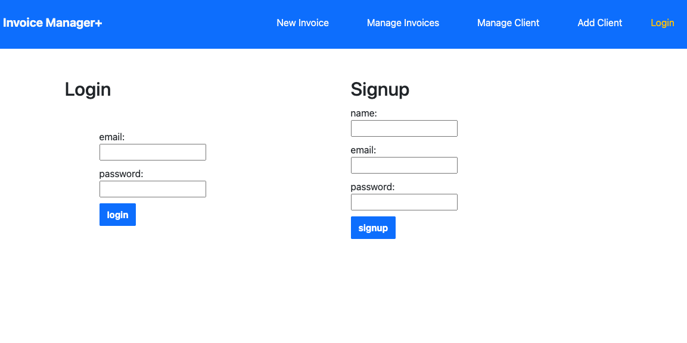
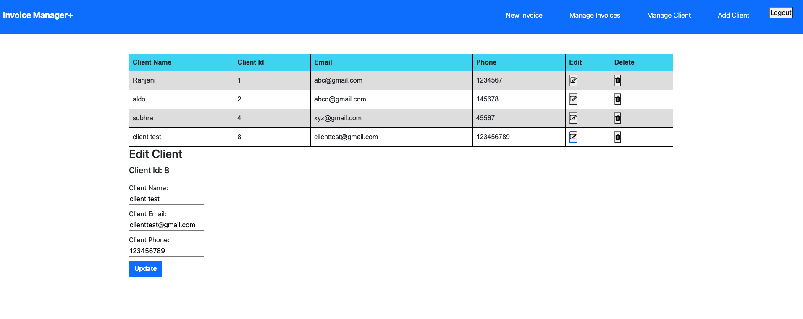
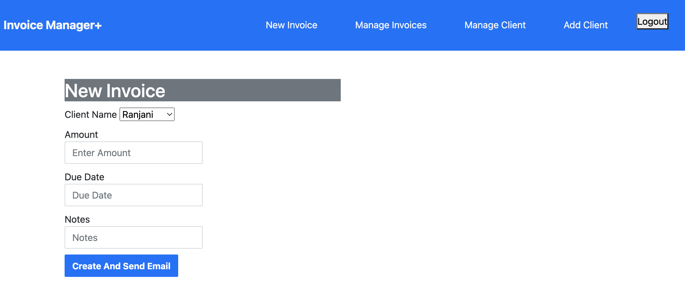
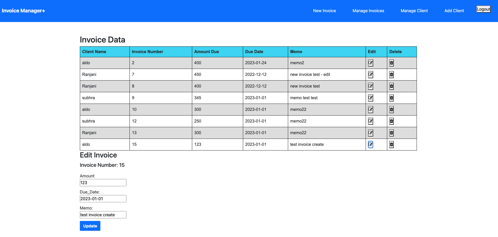

# Invoice Manager 

## Description
* As a small business owner, user should be able to keep track of client information and their invoices.

## Table to contents

-[Description](#description)

-[Acceptance Criteria](#acceptance-criteria)

-[Installation Steps](#installation-steps)

-[Mock-up Screen](#mock-up-screen)

## Acceptance-criteria

* Given a Invoice Manager application:
* WHEN user opens the Invoice Manager app, THEN user is preseted with a homepage page that displays title and navigation options
* WHEN user clicks on Login, user is presented with both login form and sign-up form
and user enters details for sign up, THEN a new user account is created and data is updated to USER table and user is taken to homepage
* WHEN user enters details for login form, THEN data is validated against the USER table and taken homepage
* WHEN user clicks on any options in My Dashboard (New Invoice, Manage Invoice, Client), THEN user login is validated
* WHEN user clicks on New Invoices, THEN new invoice page is displayed which allows user to create New Invoices and data is stored in Invoice table
* WHEN user clicks on Send email on New Invoice, THEN user is able to get soft copy of the invoice
* WHEN user clicks on Manage Invoices, THEN user is displayed with all the invoices from Invoice table
* WHEN user clicks on edit button in the Manage Invoice page, THEN user is displayed with form and is loaded with current values.
* WHEN user clicks on update button under edit invoice, THEN user is taken back to Invoice page with updated information from Invoice table
* WHEN user clicks on delete button in Invoice page, THEN invoice is detleted from table and user is displayed updated information from Invoice
* WHEN user clicks on Client under My Dashboard, THEN user is taken to client page that displays existing clients and Add new client button
* WHEN user clicks on Add new client, then user is able enter the new client details and updated to client table
* WHEN user clicks on edit/delete button in client page, THEN necessary details are updated/deleted from client table

## Installation steps

* install the following:
npm init ,
npm install express,
npm install mysql2,
mpm install sequelize,
mpm install dotenv,
npm install bcrypt,
npm install express-session,
npm install handlebars,
npm install nodemailer,
npm install connect-session-sequelize,
npm install express-handlebars,
npm install pdf-kit

* To invoke, in terminal give command - node server.js 

* Test data is available in seeds for invoice and client. To udpate run node seeds/index.js

* Future development: Add functionality to send reminder email on due date, Add valid error handling messages, Add functionlity to display client_name in new invoice page

## Mock-up screen

### Github URL: 
https://github.com/Sivaparam/invoice_manager

### Live URL: 
https://invoice-manager-pro.herokuapp.com/

